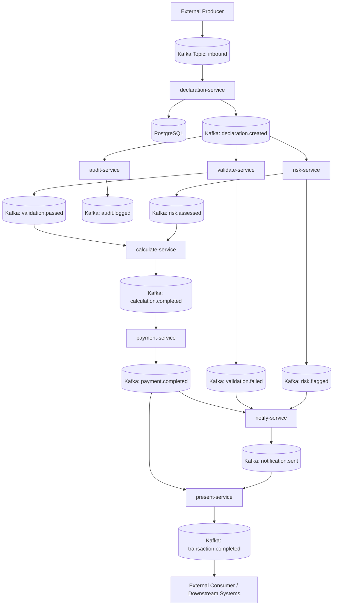
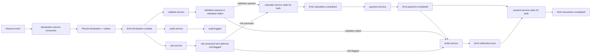

# Architecture and Message Flow

This document describes the high-level architecture of the `hi-volume-services` platform and the end-to-end event flow through all services.

## 1) Platform Architecture Diagram

## 2) Message Flow Chart

## Notes

- Every service writes to its own schema/tables and emits follow-up events.
- The pattern uses asynchronous Kafka communication and per-service persistence.
- `calculate-service` and `present-service` are join/aggregation points that wait on multiple prerequisite events.
